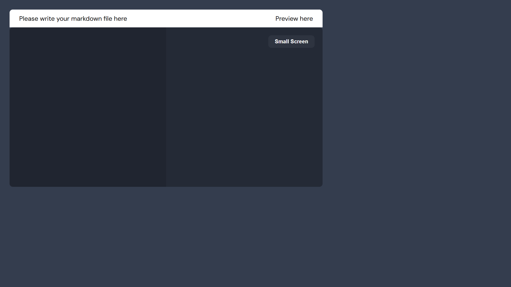

# Markdown Previewer Application

## Features

### Markdown Input Area:

- A textarea where users can enter markdown text.

### Real-Time Preview:

- As users type in the textarea, the formatted markdown preview updates automatically in real-time.

### Markdown Parsing:

- Built-in functionality to parse markdown syntax, using a library marked.js.

### Dynamic DOM Updates:

- The preview area dynamically updates without requiring any backend API calls.

### Basic Markdown Support:

- Handles common markdown elements such as headings, bold, italics, lists, links, and code blocks.

### Responsive Layout:

- The input and preview areas are organized for seamless usage across different screen sizes.

### Clear Separation of Input and Preview:

- Distinct sections for writing markdown and viewing the resulting formatted output.

## Screenshots



## Deployment Link

[Live Demo]()

## How to Use

Enter Markdown Text: Type your markdown content into the provided textarea.
Real-Time Formatting: Observe the preview updating instantly as you type.
Preview Area: View how your markdown renders as formatted HTML in the designated preview section.
Supported Syntax: Use common markdown elements such as headings (# Heading), bold (**bold**), italics (_italic_), lists (- Item), links ([Link](URL)), and code blocks (\\\code\\\`).
Responsive Design: Experience smooth functionality on various screen sizes, whether on mobile, tablet, or desktop.
No Backend Required: Everything runs in the browser, so no API calls or server interactions are needed.

## Installation

1. Clone the repository:
   ```sh
   git clone 
   ```
2. Open `index.html` in a browser.
3. Start reading new quotes!

### Technologies Used

- HTML
- CSS
- JavaScript

## Contributing

Feel free to submit issues or pull requests to improve the application.

## License

This project is open-source and available under the [MIT License](LICENSE).
